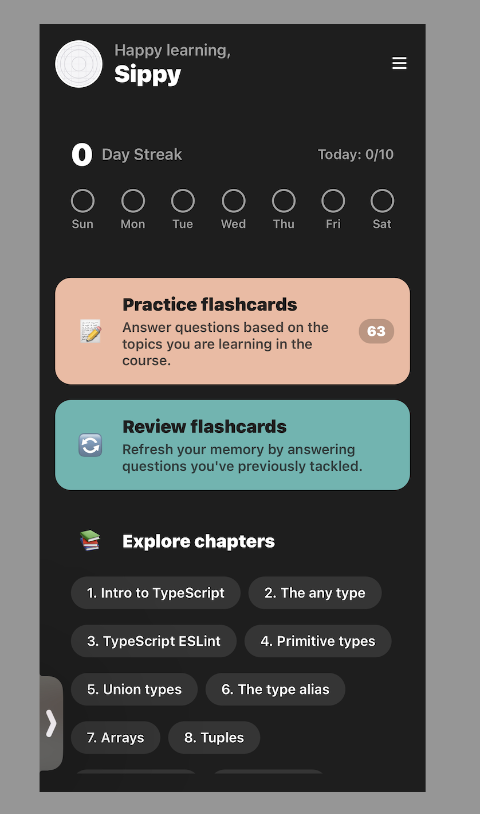

# Tech Quiz App

A React Native quiz application built with Expo, focusing on technical questions and clean architecture.

## Project Structure

```
tech-quiz/
├── assets/         # Images and assets
├── src/           # Source code
│   ├── app/       # Main application code
│   ├── components/# Reusable components
│   └── constants/ # Constants and configuration
├── .eslintrc.js   # ESLint configuration
├── .prettierrc    # Prettier configuration
├── app.json        # Expo configuration
└── package.json    # Project dependencies and scripts

## Splash Screen Versions



## Getting Started

1. Clone the repository
2. Install dependencies:
   ```bash
   npm install
   ```
3. Start the development server:
   ```bash
   npm start
   ```
